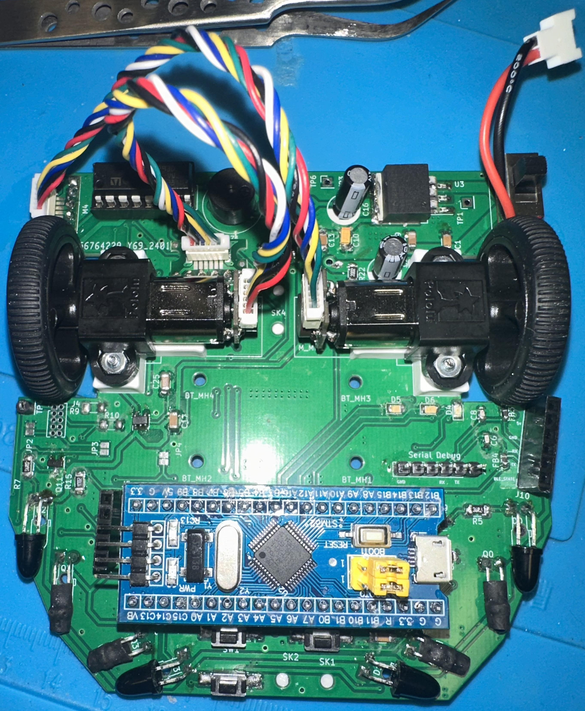

# Micromouse - Institute of Electrical and Electronic Engineers
"Macro Rat" is an autonomouse robot designed to navigate and solve maze problems using FloodFill. In this repository, I share how my team and I achieved this with invaluable guidance from some incredibly supportive individuals. 

# Preview

Explore my journey into robotics with this Micromouse project! During my Fall quarter at UC Irvine, I collaborated with a team in IEEE to build a robot capable of autonomously solving a maze. This repository includes a beginner-friendly guide covering everything from assembling hardware to coding maze-solving algorithms. It's packed with insights,
tips, and the lessons I learned along the way. If you're passionate about robotics or looking to start your own Micromouse project, this is the perfect place to begin.

# Hardware

- STM32: The brain of the system, processing inputs and controlling outputs.
- PCB Chassis: Provides a study framework to mount all hardware components. 
- Mini DC Motors (2): Drives the wheel, allowing forward and turning motions.
 - 7-9V Battery: Supplies power to the entire robot. 
- 7805 Voltage Regulator: Converts the battery's voltage to a stable 5V for components. 
- H-Bridge Motor Driver: Controls the direction and speed of the motors. 
- Hall Sensor Rotary Encoder: Tracks wheel rotation to measure distance and speed.
- Infrared Distance Sensors (2): Detects the robot's proximity to walls or obstacles.

This hardware forms the foundation of the Micromouse robot, enabling precise control, movement, and sensing for autonomous maze navigation.

- Arduino Uno: The brain of the system, processing inputs and controlling outputs.
- 2.2-inch Flex Sensors: To detect finger movements and translate them into electrical signals.
 Servo Motors: To actuate the fingers of the robotic hand.
- 10k Ohm Resistors: As pull-down resistors for stabilizing sensor readings.
 Fishing Strings: Acting as tendons to pull the robotic fingers.
- Elastic Rope: Providing tension for returning fingers to their original positions.
- Glove: A wearable interface for capturing the user’s movements.
- 3D-Printed Arm Model: To house the servos and mimic a realistic robotic arm.

# Purpose of this project

The "Macro Rat" Embedded Systems project is designed to introduce to new Embedded System Engineers the foundational concepts of robotics, electronics, and programming in a hands-on, engaging way. By building a robot capable of autonomously navigating a maze, participants develop a deep understanding of how various hardware components and algorithms interact to achieve a complex maze through our algorithms and advanced data structures. This project serves as an ideal starting point for anyone looking to explore the exciting field of robotics.

One primary purpose of this year-long project was to foster problem-solving skills. Navigating a maze autonomously requires the robot to analyze its environment, make decisions, and adjust its movements in real time movements. These challenges push participants to think critically, learn about algorithms like flood-fill or wall-following, and implement strategies for efficient maze-solving. It’s a practical demonstration of how theoretical concepts can be applied to real-world scenarios. Our team has gained hands-on experience with microcontrollers, sensors, motors, and other hardware components, as well as software tools like STM32 Cube IDE. By integrating these elements, the project offers a comprehensive introduction to system design and troubleshooting, skills that are vital for any aspiring engineer or maker.

Beyond the technical skills, the project emphasizes teamwork and collaboration. Building a Micromouse robot often requires dividing tasks, sharing knowledge, and overcoming obstacles as a group. This collaborative environment mirrors the dynamics of professional engineering projects, preparing participants for future endeavors in the field.

Feel free to contribute, modify, and build upon this project to take it to new heights!

